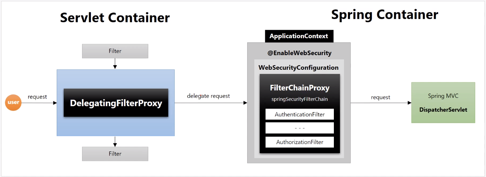

# Spring Security Architecture

## 어떻게 스프링 시큐리티는 동작할까?

### DelegationFilterProxy

스프링 시큐리티는 사용자 요청에 대해 필터기반으로 동작한다. 하지만 서블릿 필터의 경우 스프링과 별개의 기술이며, 스프링 동작 전에
거치게 되는 곳인데 어떻게 스프링 시큐리티는 필터처럼 동작할 수 있을까에 대한 의문을 가질 수 있다!

- 스프링 시큐리티는 특정한 이름을 가진 스프링 빈을 찾아서 그 빈에게 요청을 위임하게 되었다
  - `DelegationFilterProxy`라는 `서블릿 필터`가 기존 필터의 흐름 사이에 들어가게된다.
  - 하지만 `DelegationFilterProxy`는 실행은 스프링에서 관리하는 빈(`springSecurityFilterChain`)에게 위임한다.
  - 즉, 서블릿 필터에서 받은 요청에 대해 직접 보안처리를 하는 것이 아닌 스프링 빈에서 대리로 처리한다는 개념이다.

### FilterChainProxy

`springSecurityFilterChain`의 이름으로 생성되는 `Filter Bean`이며, `DelegationFilterProxy` 로 부터
실제 보안에 대한 위임을 받은 곳이다. 사용자의 요청에 따라 생성되는 필터도 존재하며, 사용자 정의 필터를 생성해 기존 필터
전, 후로 추가 가능하다. 마지막까지 예외가 발생하지 않는다면 보안에 통과하게 된다.

## 필터 초기화와 다중 설정 클래스

- 시큐리티 설정 클래스는 여러 개 생성이 가능하다
  - `antMatcher`를 별개로 설정해서 특정 리소스에 다른 설정을 주는 것이 가능하다
  - 설정 클래스 별로 필터가 각각 생성되며 `FilterChainProxy`가 각 필터를 가지고 있다
- 따라서 다수의 설정 클래스가 존재한다면, `RequestMatcher`에 따라 동작하는 필터가 달라진다
- 주의사항
  - 다중 설정 클래스는 초기화 순서를 지정해줄 수 있다.
  - 하지만 `antMatcher`에 대해 더 넓은 범위가 먼저 초기화 된다면, 구체적 범위에 대한 설정이 동작하지 않을 수 있다. 

## Authentication 객체

인증은 사용자 인증 정보를 저장하는 토큰 개념이다. 인증 시, id 와 password 를 담아 인증 검증을 위해 전달되어 사용된다.
인증 후에는 최종 인증 결과인 Authentication(`User 정보 + 권한정보`)을 `SecurityContext`에 저장된다.

- Authentication Object
  - principal : 사용자 id 또는 user 객체
  - credentials: 비밀번호
  - authorities: 사용자의 권한 목록
  - details: 인증 부가 정보
  - Authenticated: 인증 여부

## SecurityContext & SecurityContextHolder

- SecurityContext
  - `Authentication` 객체가 저장되는 보관소
    - `Authentication auth = SecurityContextHolder.getContext().getAuthentication();`
  - 필요 시, Authentication 객체를 꺼내 쓸 수 있으며 `ThreadLocal`에 저장되어 있다.
    - 즉, 아무 곳에서나 참조 가능
    - 다른 쓰레드에 공유하지않고 선언한 쓰레드에서만 접근 가능하여 Thread-safe
  - 인증이 완료되면 `HttpSession`에 저장되어 어플리케이션 전반에서 참조가 가능하다
- SecurityContextHolder
  - SecurityContext 객체 저장 방식
    - MODE_THREADLOCAL: Default, 쓰레드당 SecurityContext 객체를 할당
    - MODE_INHERITABLETHREADLOCAL: 메인 쓰레드와 자식 쓰레드에 동일한 SecurityContext 유지
    - MODE_GLOBAL: 전체 응용프로그램에서 하나의 SecurityContext 사용

## SecurityContextPersistenceFilter

SecurityContext 객체의 생성, 저장 및 조회를 위한 클래스

- 익명 사용자
  - 새로운 SecurityContext 객체를 생성해서 홀더에 저장
  - AnonymousAuthenticationFilter 에서 익명사용자용 객체를 SecurityContext 에 저장
- 인증 시
  - 새로운 SecurityContext 객체를 생성해서 홀더에 저장
  - UsernamePasswordAuthenticationFilter 에서 인증 후, AuthenticationToken 객체를 SecurityContext 에 저장
- 인증 후
  - Session 에서 SecurityContext 에서 꺼내에 홀더에 저장
  - SecurityContext 내에 Authentication 객체가 존재한다면 인증을 유지
- 최종 인증 시, 공통적으로 `clearContext()`로 초기화

## Authentication Flow

### AuthenticationManager

- 주요 기능
  - 인터페이스로 제공 되며, 구현체가 `ProviderManager`
  - AuthenticationProvider 목록 중 처리 요건에 맞는 AuthenticationProvider 를 찾아 인증 처리를 위임
    - 실제 인증 처리를 진행하지 않는다!
  - 부모 ProviderManager 를 설정하여 여러 provider 를 탐색할 수 있다. 
    - 자신이 처리할 수 없는 경우, parent 를 지정해 다른 매니저를 지정한다