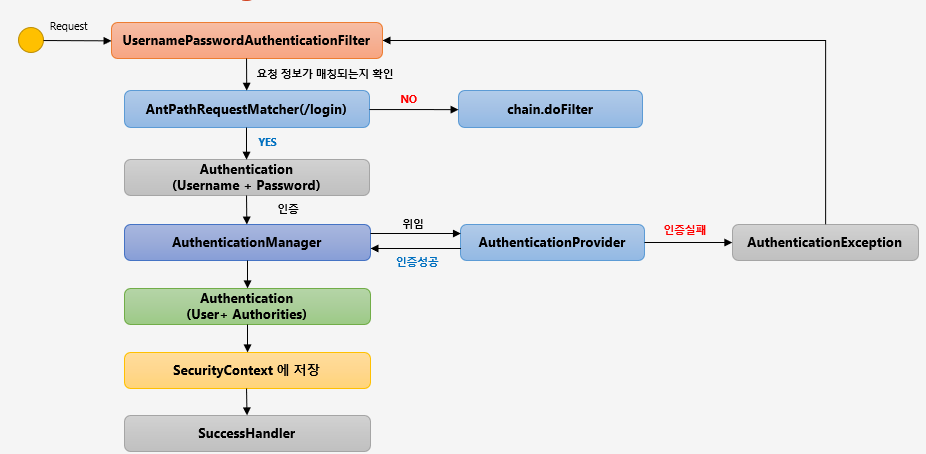
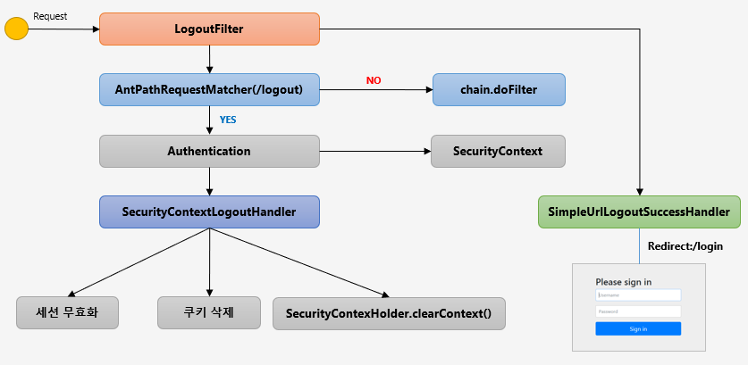
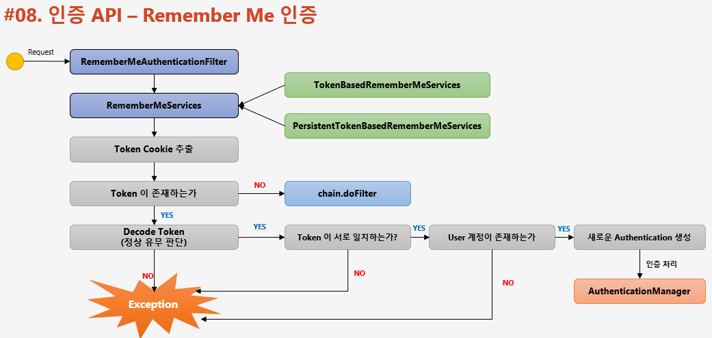

# Spring Security Basic Filter

## 인증 API

### FormLogin & UsernamePasswordAuthenticationFilter

<p align="center"></p>

```text
http.formLogin()
    ...;
```

- loginPage("login.html")
  - 사용자 정의 로그인 페이지
  - 디폴트는 시큐리티가 제공하는 페이지
- defaultSuccessUrl("/home")
  - 로그인 성공 후 이동 페이지
- failureUrl("/login.html?error=true")
  - 로그인 실패 시 이동 페이지
- usernameParameter("username")
  - 아이디 파라미터에 해당하는 부분 설정
- passwordParameter("password)
  - 패스워드 파라미터에 해당하는 부분 설정
- loginProcessingUrl("/login")
  - 로그인 Form Action URL
- successHandler(loginSuccessHandler())
  - 로그인 성공 후 핸들러
- failureHandler(loginFailureHandler())
  - 로그인 실패 후 핸들러

### Logout

<p align="center"></p>

```text
http.logout()
    ...;
```

- logoutUrl("/logout")
  - 로그아웃 처리 URL
- logoutSuccessUrl("/login")
  - 로그아웃 성공 후 이동할 페이지
- deleteCookies("JESESSIONID", "remember-me")
  - 로그아웃 후 쿠키 삭제
- addLogoutHandler(logoutHandler())
  - 기본 스프링에서 제공하는 로그아웃 핸들러 이외에 처리하고 싶은 로그아웃 핸들러를 추가
  - 익명함수로 만들시, `CompositeLogoutHandler`로 추가된다
- logoutSuccessHandler(logoutSuccessHandler())
  - 로그아웃 성공 후 핸들러

### RememberMe & RememberMeAuthenticationFilter

인증 객체가 `null`이고 `remember-me` 쿠키가 존재하는 경우, 즉 `SecurityContext` 내 `Authentication`이 없는 경우에 동작한다.

<p align="center"></p>

```text
http.rememberMe()
    ...;
```

- rememberMeParameter("remember")
  - rememberMe 파라미터 변경
  - 디폴트는 `remember-me`
- tokenValiditySeconds(3600)
  - `remember-me` 쿠키의 만료시간 설정(초)
  - 디폴트는 14일
- alwaysRemember(true)
  - 리멤버미 기능이 활성되지 않더라도 항상 실행
  - 디폴트는 false
- userDetailsService(userDetailsService)
  - 리멤버미 기능이 수행될 때, 시스템에 있는 사용자 계정을 조회하는데 필요한 클래스