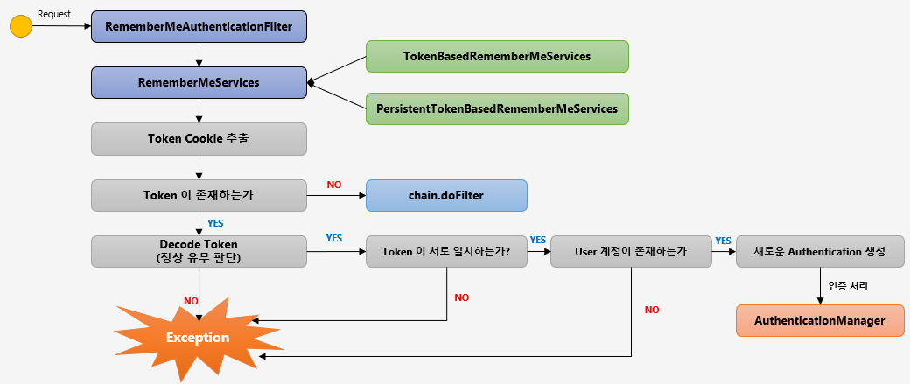

# Spring Security Basic Filter

## 인증 API

### FormLogin & UsernamePasswordAuthenticationFilter

<p align="center"></p>

```text
http.formLogin()
    ...;
```

- loginPage("login.html")
  - 사용자 정의 로그인 페이지
  - 디폴트는 시큐리티가 제공하는 페이지
- defaultSuccessUrl("/home")
  - 로그인 성공 후 이동 페이지
- failureUrl("/login.html?error=true")
  - 로그인 실패 시 이동 페이지
- usernameParameter("username")
  - 아이디 파라미터에 해당하는 부분 설정
- passwordParameter("password)
  - 패스워드 파라미터에 해당하는 부분 설정
- loginProcessingUrl("/login")
  - 로그인 Form Action URL
- successHandler(loginSuccessHandler())
  - 로그인 성공 후 핸들러
- failureHandler(loginFailureHandler())
  - 로그인 실패 후 핸들러

### Logout

<p align="center"></p>

```text
http.logout()
    ...;
```

- logoutUrl("/logout")
  - 로그아웃 처리 URL
- logoutSuccessUrl("/login")
  - 로그아웃 성공 후 이동할 페이지
- deleteCookies("JESESSIONID", "remember-me")
  - 로그아웃 후 쿠키 삭제
- addLogoutHandler(logoutHandler())
  - 기본 스프링에서 제공하는 로그아웃 핸들러 이외에 처리하고 싶은 로그아웃 핸들러를 추가
  - 익명함수로 만들시, `CompositeLogoutHandler`로 추가된다
- logoutSuccessHandler(logoutSuccessHandler())
  - 로그아웃 성공 후 핸들러

### RememberMe & RememberMeAuthenticationFilter

인증 객체가 `null`이고 `remember-me` 쿠키가 존재하는 경우, 즉 `SecurityContext` 내 `Authentication`이 없는 경우에 동작한다.

<p align="center"></p>

```text
http.rememberMe()
    ...;
```

- rememberMeParameter("remember")
  - rememberMe 파라미터 변경
  - 디폴트는 `remember-me`
- tokenValiditySeconds(3600)
  - `remember-me` 쿠키의 만료시간 설정(초)
  - 디폴트는 14일
- alwaysRemember(true)
  - 리멤버미 기능이 활성되지 않더라도 항상 실행
  - 디폴트는 false
- userDetailsService(userDetailsService)
  - 리멤버미 기능이 수행될 때, 시스템에 있는 사용자 계정을 조회하는데 필요한 클래스

### AnonymousAuthenticationFilter

<p align="center"></p>

익명 사용자 인증 처리를 위한 필터이며, 익명 사용자와 인증 사용자를 구분해 처리하기 위한 목적으로 사용된다.  
굳이 익명 토큰을 만드는 이유는 뭘까? 바로 `SecurityInterceptor`에서 최종적인 리소스 접근에 대한 확인을 할 때,
토큰 자체가 존재하지 않으면 예외를 발생시키기 때문에 익명 토큰을 만들어 통과시켜준다.

### 동시 세션 제어

서버에서 `같은 계정에 대해` 최대 세션 허용 갯수가 초과되는 경우 어떤 전략으로 세션을 관리할까?

1. 이전 사용자 세션 만료
   - 사용자 1이 인증에 성공해서 세션이 생성됨
   - 사용자 2가 접속하는 경우 사용자 1의 세션을 만료 시킴
   - 사용자 1이 다시 접속하는 경우 세션이 만료되어 재발급 받아야함
2. 현재 사용자 인증 실패
   - 사용자 1이 인증에 성공해서 세션이 생성됨
   - 사용자 2가 접속하지만, 세션을 발생하지 못하고 인증 예외 발생

```text
http
    .sessionManagement()
```

- maximumSession(1)
  - 최대 허용 세션 수
  - -1 인 경우 무제한 로그인 세션
- maxSessionPreventsLogin(true)
  - 동시 로그인 차단을 위한 옵션(2번 전략)
  - false(default) 이면, 기존 세션을 만료시킨다 (1번 전략)
- invalidSessionUrl("/invalid")
  - 세션이 유효하지 않을 때 이동하는 페이지
- expiredUrl("/expired")
  - 세션 만료 시 이동할 페이지
- sessionFixation().changeSessionId()
  - 세션 고정보호용 옵션(default)
  - 사용자가 로그인할 때마다 새로운 세션을 바꿔준다
- sessionCreationPolicy(If_Required)
  - 세션 생성 정책
  - Always: 항상 생성
  - If_Required: 필요시 생성, 디폴트
  - Never: 시큐리티가 생성하진 않지만, 이미 존재한다면 사용
  - Stateless: 시큐리티가 생성하지 않고, 존재해도 사용안함

### SessionManagementFilter & ConcurrentSessionFilter

<p align="center"></p>

- SessionManagementFilter
  1. 세션관리
  2. 동시 세션 제어
  3. 세션 고정 보호
  4. 세션 생성 정책
- ConcurrentSessionFilter
  - 매 요청마다 사용자의 세션 만료 여부를 체크하는 필터
  - 세션 만료시 `session.isExpired() == true`
    - 로그아웃 처리
    - 오류 페이지 응답

--- 

## 인가 API

### 권한 설정

1. 선언적 방식
   - URL
     - `http.antMatchers("/users/**").hasRole("USER")`
   - Annotation
     - `@PreAuthorize("hasRole("USER")")`
2. 동적 방식
   - URL
   - Method

### 표현식

<p align="center"></p>

