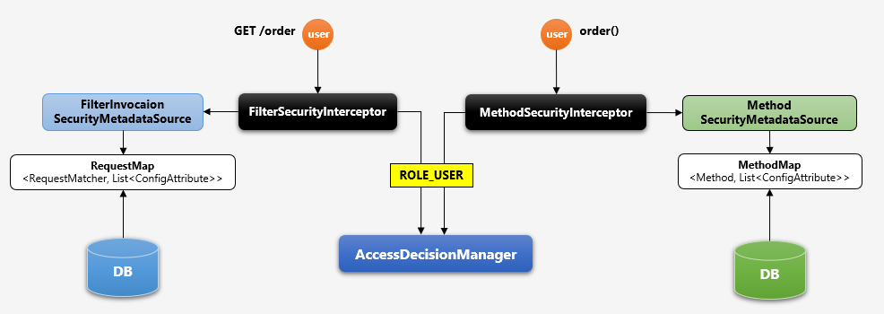
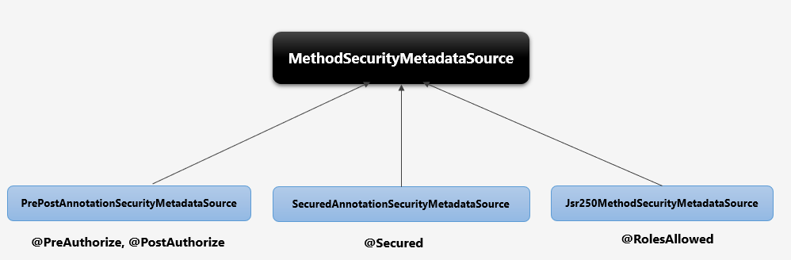
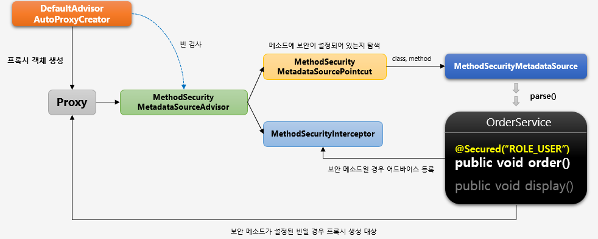

# 메소드 기반 인가

Filter 기반 처리는 요청을 filter 에서 가로채서 인가를 진행하고, Method 방식은 proxy 객체가 메소드를 호출하고 등록된
`Advice`를 작동하게해서 인가처리를 진행한다.

## Intro

메소드 기반 인증 인가는 서비스 계층의 처리 방식이다. 즉, 리소스 단위가 아니고 메소드 처리 전, 후로 보안 검사를
수행하여 인가처리를 진행하게 된다. 보안 설정 방식은 `어노테이션` 또는 `맵 기반` 권한 설정 방식이 존재한다.

- URL 방식은 Filter 기반 Method 방식은 AOP 기반으로 동작한다.

## 어노테이션 권한 설정

보안이 필요한 메소드에 어노테이션을 설정한다

- @PreAuthorize, @PostAuthorize
  - `@PreAuthroize("hasRole('ROLE_USER') and (#account.username == principla.username)`
  - SpEL 지원
  - `PrePostAnnotationSecurityMetadataSource`가 담당한다
- @Secured, @RolesAllowed
  - `@Secured("ROLE_USER"), @RolesAllowed("ROLE_USER")`
  - SpEL 미지원
  - `SecuredAnnotationSecurityMetadataSource`, `Jsr250MethodSecurityMetadataSource`가 담당
- @EnableGlobalMethodSecurity(prePostEnabled = true, securedEnabled = true)를 설정해줘야한다.

## AOP Method 기반

### 아키텍쳐

1. 초기화 시
   - 전체 빈을 검사하면서 보안이 설정된 메소드가 있는지를 탐색하고 발견된다면, 빈의 Proxy 객체를 생성한다.
   - 보안 설정된 함수에 인가처리 기능을 하는 `Advice(MethodSecurityInterceptor)`를 등록한다
   - 따라서, 빈을 참조할 때 실제 빈이 아닌 proxy bean 을 참조하게 된다
2. 런타임 시
   - 함수가 호출되면, 프록시 객체를 통해 실제 메소드를 호출한다
   - Advice 가 등록된 메소드라면 Advice 를 동작시키고 인가처리를 진행한다
   - 권한 심사가 통과한다면, 실제 빈의 메소드를 호출하게 된다.