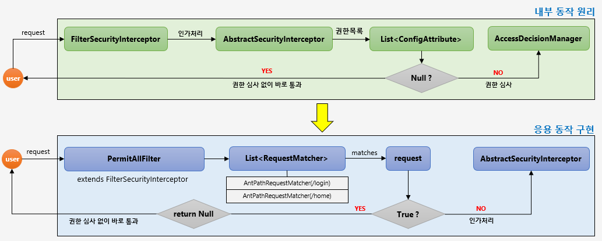
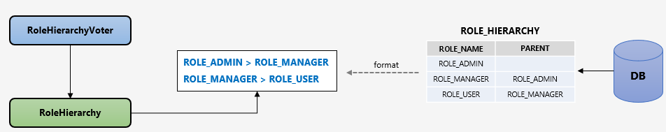

# 웹기반 인가 처리 아키텍쳐

## 주요 아키텍쳐

- `http.antMatchers("/user").access("hasRole('USER');`
  - 사용자가 `/user` 자원에 접근하기 위해서는 `ROLE_USER`의 권한이 필요하다
  - 권한 정보는 Map 형태로 `/user`와 `ROLE_USER`를 저장해둔다
  - `ExpressionBasedFilterInvocationSecurityMetadataSource`
- 특정 리소스로 접근하게 되면 다음 정보를 가지고 `AccessDecisionManager`로 접근한다.
  - 인증 정보 (Authentication)
  - 요청 정보 (FilterInvocation)
  - 권한 정보 (List<ConfigAttribute>)

### FilterInvocationSecurityMetadataSource

- 사용자가 접근하는 Url 자원에 대한 권한 정보를 추출한다
  - 만약 권한 정보를 추출하지 못한다면, 인가 처리를 진행하지 못하고 다음 필터로 넘어감
  - 즉, 인가없이 리소스에 접근해버리는 문제가 생김
- `AccessDecisionManager`에 전달하여 인가처리 수행
- 사용자의 모든 요청마다 요청정보에 매핑된 권한 정보를 확인한다

### PermitAllFilter

인증 및 권한 심사를 할 필요없는 자원(`/, /home, /login`)등을 미리 설정해서 리소스에 바로 접근 가능하게 하는 필터.
즉 인증 및 인가를 할 필요없는 리소스에 대해 불필요한 검사 과정을 생략할 수 있다.

### Role Hierarchy

권한에 계층을 도입해, 상위 계층은 하위 계층의 role 의 자원에 접근 가능하게 변경.